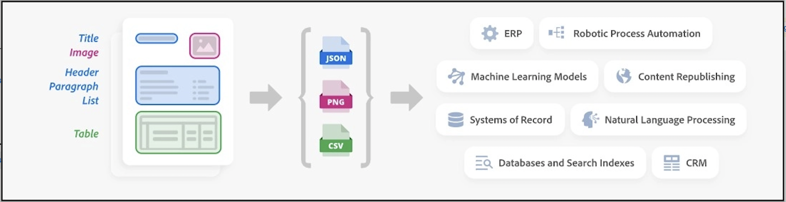

# NEJM Case Records Test Data Generation

This repo contains the code and instruction to extract text from the PDF files of NEJM case reports and convert them into JSON format using Adobe PDF Extract API. The JSON files are then parsed to create datasets for further analysis or evaluation.
## 0. Background 
### [0.1 NEJM Case Records of the Massachusetts General Hospital](https://www.nejm.org/browse/nejm-article-type/case-records-of-the-massachusetts-general-hospital)
Case records of the massachusetts general hospital are published in the New England Journal of Medicine (NEJM), around 40 cases per year. The case reports contains valuable information regarding clincial cases presentations and diagnoses that can be used for diagnostic reasoning. Due to [NEJM's term of use](https://www.nejmgroup.org/legal/terms-of-use.htm), we can not use the content extracted to train any AI models. Therefore, the content extracted will only be used for evaluation purposes. 

### 0.2 Adobe PDF Extract API (PDF -> JSON)
The PDF Extract API (included with the PDF Services API) is a cloud-based web service that uses Adobe’s Sensei AI technology to automatically extract content and structural information from PDF documents – native or scanned – and to output it in a structured JSON format. The service extracts text, complex tables, and figures as briefly summarized in [this link](https://developer.adobe.com/document-services/docs/overview/pdf-extract-api/).

  

#### 0.2.1 Python user quick start
For python user, to get started, please refer to this [quickstart tutorial](https://developer.adobe.com/document-services/docs/overview/pdf-extract-api/quickstarts/python/), which involves three steps:
* **Getting credentials** : This step will eventually download a zip file `PDFServicesSDK-Python Samples.zip` containing the scripts that you will be using for the pdf extraction. 
* **Setting up the project**: Install API and place credentials
* **Creating the application**: use the code provided for `extract.py` or refer to this [repo](https://github.com/adobe/pdfservices-python-sdk-samples/tree/main/src/extractpdf) depends on your need

## 1. How to use 
* 1.1 Download pdfs manually from [NEJM Case Records](https://www.nejm.org/browse/nejm-article-type/case-records-of-the-massachusetts-general-hospital),rename the pdf file to `nejm_case_YEAR_NUM.pdf` and place them in the `NEJM_case_pdf` folder.
* 1.2 Run the `nejm_case_pdf2jsonzip_byyear.sh` script to extract the downloaded pdf files in batches by the specified year and save them in the `NEJM_case_json` folder.
  * Example of running the script: `bash nejm_case_pdf2jsonzip_byyear.sh ./NEJM_case_pdf ./NEJM_case_json 2008`, which will find the pdf files in the `NEJM_case_pdf` folder that are published in 2008 (based on the file name)， extract and save the ouput zip files in the `NEJM_case_json` folder.
  * The shell script call the `extract_txt_from_pdf_adobe.py` script from adobe extract API to do the acutal extraction for each pdf file.
  * Make sure you have the `pdfservices-api-credentials.json` file in the working directory so that the credentials can be loaded in the script `extract_txt_from_pdf_adobe.py` to authenticate the API call and do the job. 
* 1.3 After the extraction, you can use `unzip_json.py` to unzip the zipped json files all at once and save them in the `NEJM_case_json_unzip` folder. Note that this script will clean up the target folder `NEJM_case_json_unzip` before unzipping the files.
  * Example: `python unzip_json.py NEJM_case_json NEJM_case_json_unzip`
* 1.4 Parse the json files to create a combined dataset for further analysis or evaluation. The `parse_collect.py` script will loop through all the unzipped json files in the source folder `NEJM_case_json_unzip` folder and parse the content in need. Basically, the `parse_collect.py` script utilizes the font size and some other unique features associated with the titles/subtitles to identify different sections of the case reports, and then use pointers to create sliding window to capture the information regarding case_id, case presentation, differential diagnosis, doctor's diagnosis, final diagnosis,etc. The parsed content will be saved in the `NEJM_case_dataset.jsonl` file, each line represents the required text extracted from a case report.
  * Use example: `python3 parse_collect.py NEJM_case_json_unzip `
  * The `NEJM_case_dataset.jsonl` has the following feature extracted
    * **source**: the source of the case report: NEJM case records of the massachusetts general hospital
    * **year**: year that the case report was published
    * **case_num**: the case number of the report in that year
    * **id**: the unique identifier for the case report, formatted as `nejm-case-year-case_num`
    * **title**: the title of the case report
    * **presentation_of_case**: the presentation of the case, should be available in all case reports
    * **differential_diagnosis**: the differential diagnosis of the case report, not always available
    * **drs_diagnosis**: the doctor's (often times also the first author of the report) diagnosis, not always available
    * **final_diagnosis**: the final diagnosis of the case report, not always available
    * **final_diagnosis_comb**: the synthesized final diagnosis, which is the combination of the doctor's diagnosis and the final diagnosis: first use the final diagnosis, if not available, use the doctor's diagnosis instead; if both are not available, then treat it as missing.
* 1.5 Sanity check and data processing using `test_data_sanity_check.ipynb`, which (mannually) checks the extracted data for missing values and mistakes, and then save the processed data based on the need. 
